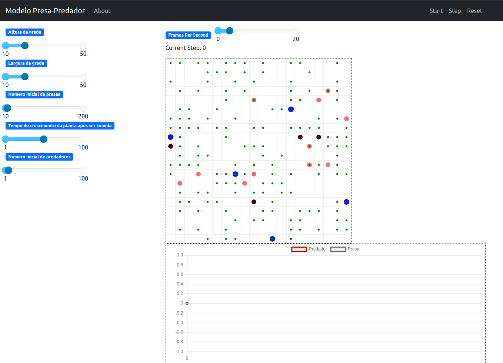
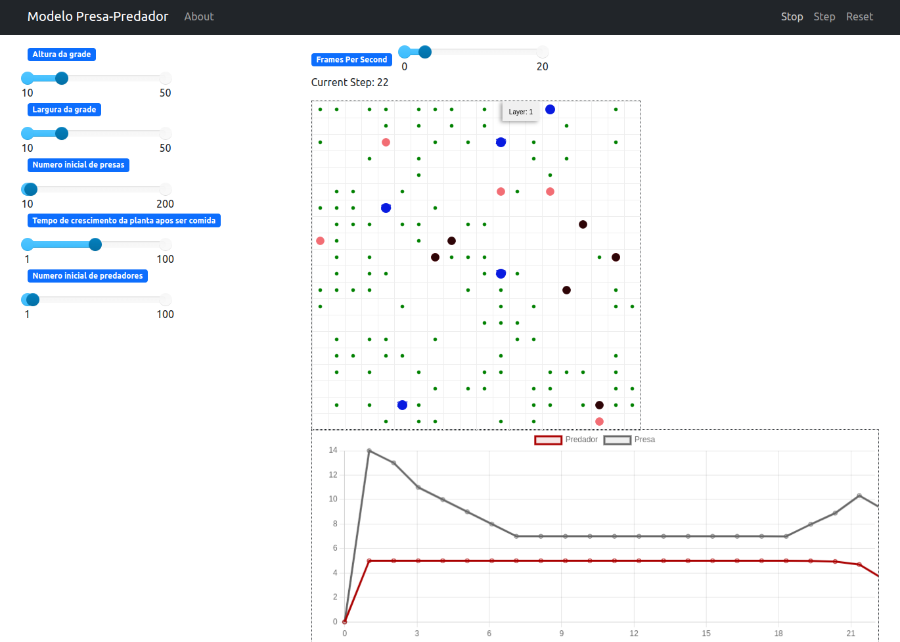
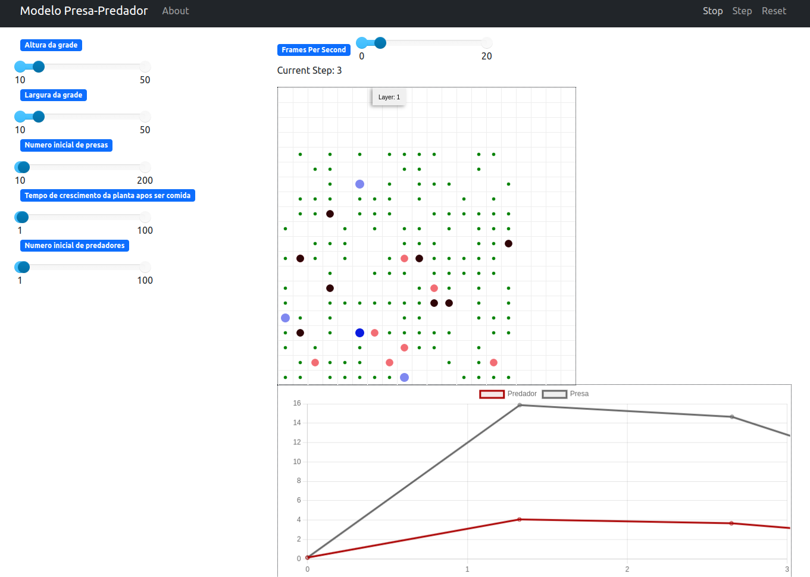
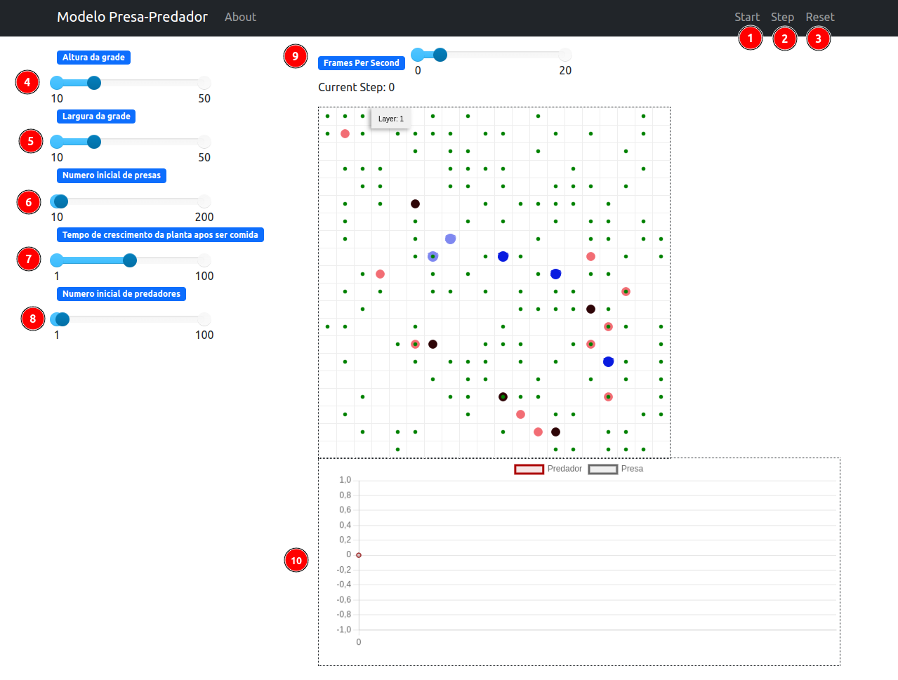

# Simulação de Presa-Predador

**Disciplina**: FGA0210 - PARADIGMAS DE PROGRAMAÇÃO - T01 <br>
**Nro do Grupo:**: 06<br>
**Paradigma**: Sistemas Multiagentes<br>

## Alunos
|Matrícula | Aluno |
| -- | -- |
| 22/2015103  |  Debora Caires de Souza Moreira |
| 20/2016480  |  Hellen Fernanda Mendonça de Faria |
| 19/0090901  |  Laura Pinos de Oliveira |
| 21/2005426  |  Lucas Gomes Caldas |
| 19/0037997  |  Sidney Fernando Ferreira Lemes |

## Sobre 

O projeto visa simular dinâmicas de um ecossistema presa-predador usando a biblioteca Mesa em Python. Através da criação de um modelo baseado em agentes, o objetivo é observar como a interação entre presas, predadores e plantas pode influenciar nas populações ao longo do tempo.

Utilizando a simulação baseada em agentes, o projeto busca explorar como fatores como reprodução, alimentação, crescimento de plantas, predatórios e mortalidade podem impactar a dinâmica e a estabilidade do ecossistema. Ao ajustar parâmetros e observar as interações entre os agentes, a simulação procura oferecer insights sobre os padrões emergentes resultantes dessas interações complexas no contexto do modelo presa-predador.

- Nascimento das Plantas
  - No início da simulação, um número determinado de plantas é criado em posições aleatórias no grid. Essas plantas possuem um contador regressivo para indicar o tempo até estarem totalmente crescidas e prontas para serem consumidas pelas presas.
- Posicionamento aletório de Presas e Predadores
  - Tanto as presas quanto os predadores são posicionados aleatoriamente no grid na inicialização do modelo.
  - As presas e os predadores têm atributos como vida, idade, idade fértil, sexo, entre outros.
- Alimentação das Presas e Predadores:
  - As presas têm a capacidade de se alimentar das plantas. Quando uma presa ocupa a mesma célula que uma planta totalmente crescida, ela a consome, aumentando sua vida em uma quantidade específica.
  - Por sua vez, os predadores se alimentam das presas. Quando um predador ocupa a mesma célula que uma presa, ele a consome, aumentando sua própria vida.
- Reprodução das Presas e Predadores:
  - As presas e os predadores fêmeas têm a possibilidade de se reproduzir se estiverem na idade fértil. Isso acontece com uma probabilidade determinada.
  - Quando ocorre a reprodução, um novo agente (presa ou predador) é gerado na mesma célula que o agente progenitor. No entanto, o agente progenitor perde metade da sua vida após a reprodução bem-sucedida.
- Envelhecimento e Mortalidade:
  - Ao longo do tempo, a idade dos agentes (presas e predadores) aumenta. Além disso, a vida dos agentes vai diminuindo.
  - Se um agente atinge uma idade superior a um valor específico (como 50 passos, por exemplo) ou se a vida de um agente chega a zero, ele morre e é removido do modelo.

## Screenshots







## Instalação 
**Linguagens**: [Python 3.x](https://www.python.org/)<br>
**Tecnologias**: [Mesa](https://mesa.readthedocs.io/en/stable/)<br>

O Mesa é uma biblioteca em Python que possibilita a criação, visualização e análise de modelos baseados em agentes

- Instale os requirements: ```pip install -r requirements.txt```

## Uso
- Instale o Python
- Execute o código ```run.py``` para iniciar a aplicação.
- O servidor provavelmente ficará aguardando conexões em localhost:8521 (ou seja, no seu próprio computador, na porta 8521). Você poderá acessar essa interface por meio de um navegador da web digitando http://localhost:8521 na barra de endereços.

### Uso da interface

A página exibida no navegador é a seguinte:



Onde:
1. Inicia ou para a simulação;
2. Avança 1 passo na simulação;
3. Reincia a simulação;
4. Escolhe a altura da grade;
5. Escolhe a largura da grade;
6. Número de presas que iniciam a simulação;
7. Escolhe em quantos passos as plantas comidas voltam a crescer;
8. Número de predadores que iniciam na simulação
9. Quantos passos avançam em cada segundo;
10. Gráfico com número de presas e predadores a cada passo;

Ao mudar os valores, a simulação deve ser reiniciada.


## Vídeo
Adicione 1 ou mais vídeos com a execução do projeto.
Procure: 
(i) Introduzir o projeto;
(ii) Mostrar passo a passo o código, explicando-o, e deixando claro o que é de terceiros, e o que é contribuição real da equipe;
(iii) Apresentar particularidades do Paradigma, da Linguagem, e das Tecnologias, e
(iV) Apresentar lições aprendidas, contribuições, pendências, e ideias para trabalhos futuros.
OBS: TODOS DEVEM PARTICIPAR, CONFERINDO PONTOS DE VISTA.
TEMPO: +/- 15min

## Participações
Apresente, brevemente, como cada membro do grupo contribuiu para o projeto.
|Nome do Membro | Contribuição | Significância da Contribuição para o Projeto (Excelente/Boa/Regular/Ruim/Nula) |
| -- | -- | -- |
| Sidney Fernando F. Lemes |  Minha contribuição para o projeto incluiu a pesquisa e apresentação de ideias de projetos para o grupo, bem como a organização mais eficiente dos módulos do projeto. Além disso, implementei funcionalidades que permitiram aos agentes terem sexos distintos, introduzi um mecanismo de mortalidade para os agentes e desenvolvi a lógica de reprodução para eles. Estas adições permitiram uma representação mais realista e dinâmica do comportamento dos agentes no modelo de simulação do ecossistema presa-predador. | Excelente |

## Outros 
Quaisquer outras informações sobre o projeto podem ser descritas aqui. Não esqueça, entretanto, de informar sobre:
(i) Lições Aprendidas;
(ii) Percepções;
(iii) Contribuições e Fragilidades, e
(iV) Trabalhos Futuros.

## Fontes
- [A Multi-Agent System in Python](https://medium.com/agents-and-robots/a-multi-agent-system-in-python-74701f256c3a)
- [SMA-Prey-Predator-project](https://github.com/jerome-auguste/SMA-Prey-Predator-project)
